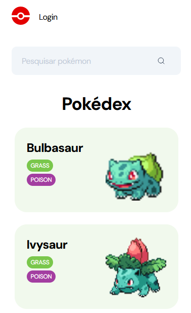
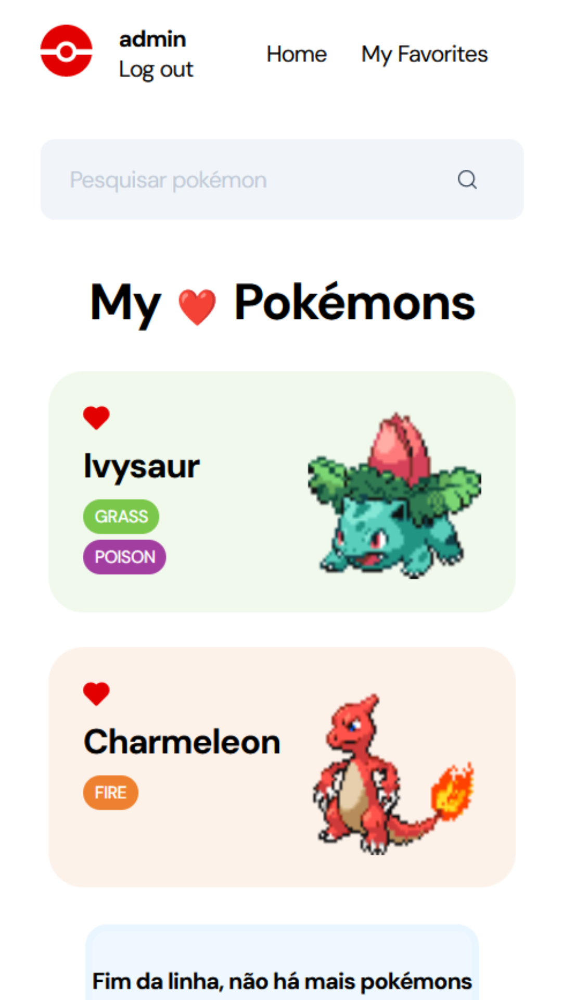
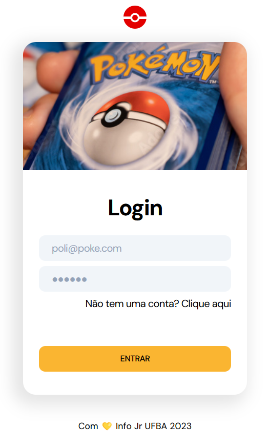

# 🔍 Pokedex

  

  
  
  
  
   
   
   

<h1 align="center">
    
</h1>

<h4 align="center"> 
	🚧 Pokedex 🚧
</h4>

	

## 💻 Sobre o Projeto

A Pokédex, também conhecida como Poké-Agenda no Brasil é uma enciclopédia virtual portátil de alta tecnologia que os treinadores Pokémon transportam para registra todas as espécies diferentes de Pokémon que são encontradas durante a sua viagem como treinadores. Este é um projeto **Full Stack**, ou seja, abrange tanto o **Front-end** quanto o **Back-end** e tem como objetivo criar uma experiência imersiva para treinadores Pokémon explorarem informações detalhadas sobre diferentes espécies de Pokémons.

## 📋 Funcionalidades

- Pesquisa de Pokémon por nome;
- Visualização detalhada de cada Pokémon, incluindo imagem (nessa pokedex eu utilizei o gif frontal), tipos, evoluções, habilidades e descrição;
- Lista completa de todas as espécies de Pokémon disponíveis;
- Marcação de Pokémon como "Favoritos" para fácil acesso (disponível apenas ao logar);
- Design responsivo para uso em dispositivos móveis e descktop com uma experiência adaptável;
- Sistema de cadastro e login para usuários, permitindo a criação de contas individuais;
- Usuários autenticados podem salvar seus Pokémon favoritos e acessá-los facilmente;

## 🎨 Layout

O layout da aplicação está disponível no Figma:

### Mobile

	
	
	

### Web

  

  

---

## ▶️ Como executar o projeto

Este projeto é divido em duas partes:
1. Back-end ([pasta api](https://github.com/polianams/pokedex/tree/main/src/app/api);
2. Front-end: Desktop e Mobile ([pasta app](https://github.com/polianams/pokedex/tree/main/src/app))

### 🛠️ Pré-requisitos

- Possuir um editor de código-fonte, por exemplo [VSCode](https://code.visualstudio.com/download) ou [Vim](https://www.vim.org/download.php);
- Possuir o [Git](https://git-scm.com/downloads) ou qualquer outro programa de versionamento;
- Possuir o [Node.js](https://nodejs.org/en/download/current) (versão 18.16.0 ou superior);
- Possuir o [Insomnia](https://insomnia.rest/download) instalado.

### ⚙️ Instalação

1. Clone este repositório para sua máquina local:
2. Navegue até o diretório do projet: `cd nome_da_pasta`;
3. Instale as dependências: `npm install`;
4. Para executa-lo digite no terminal: `npm run dev`;
5. O servidor será iniciado na porta 8000.

## 🚀 Tecnologias utilizadas

- Next.js;
- Typescript;
- API [PokeAPI](https://pokeapi.co/);
- Banco de dados relacional usando Prisma e SQLite.
  
## 🤝 Contribuição

Contribuições são bem-vindas! Se você quiser melhorar ou adicionar novos recursos a esta API, siga as etapas abaixo:

1. Crie um Fork deste repositório;
2. Crie uma branch para suas alterações: `git checkout -b my-feature`;
3. Commit suas alterações: `git commit -m 'Adicionar nova funcionalidade'`;
4. Faça push para a branch: `git push origin my-feature`;
5. Abra um pull request;

## 🧙‍♂️ Autores

- Projeto Full Stack desenvolvido por: [Poliana Santos](https://www.linkedin.com/in/polianams/) ✨
- Layout do Figma disponibilizado por [InfoJr](https://infojr.com.br/) ✨

---

## 📝 Licença

<!-- Este projeto esta sobe a licença [MIT](./LICENSE). -->

Feito por Poliana Santos 👋🏽 [Entre em contato!](https://www.linkedin.com/in/polianams/)

Divirta-se explorando a incrível jornada Pokémon com a nossa Pokédex! 🌟
